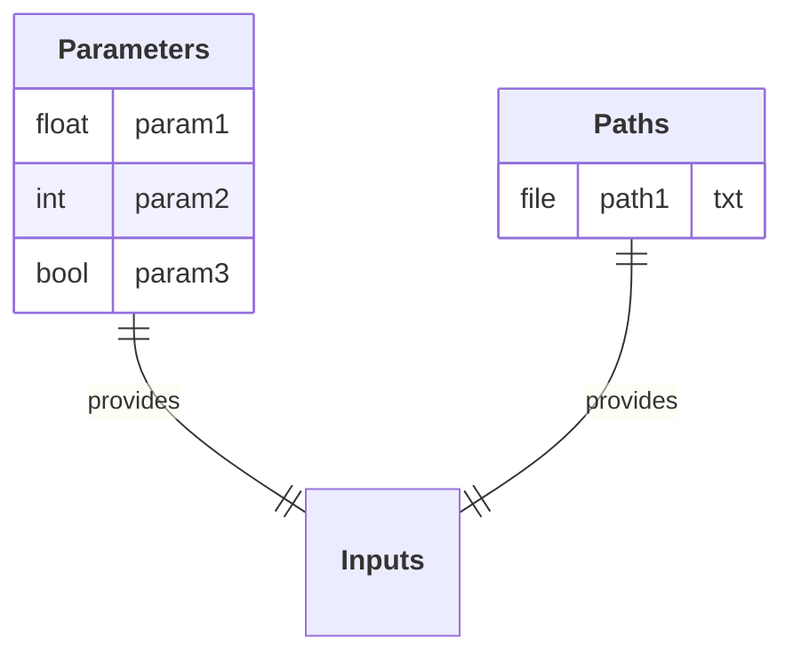
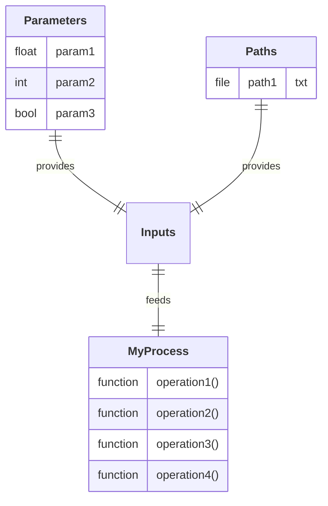
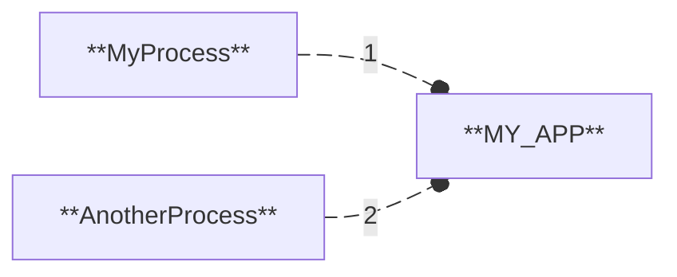
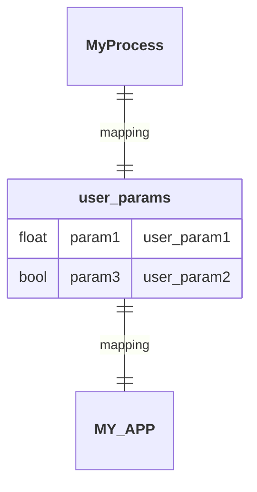
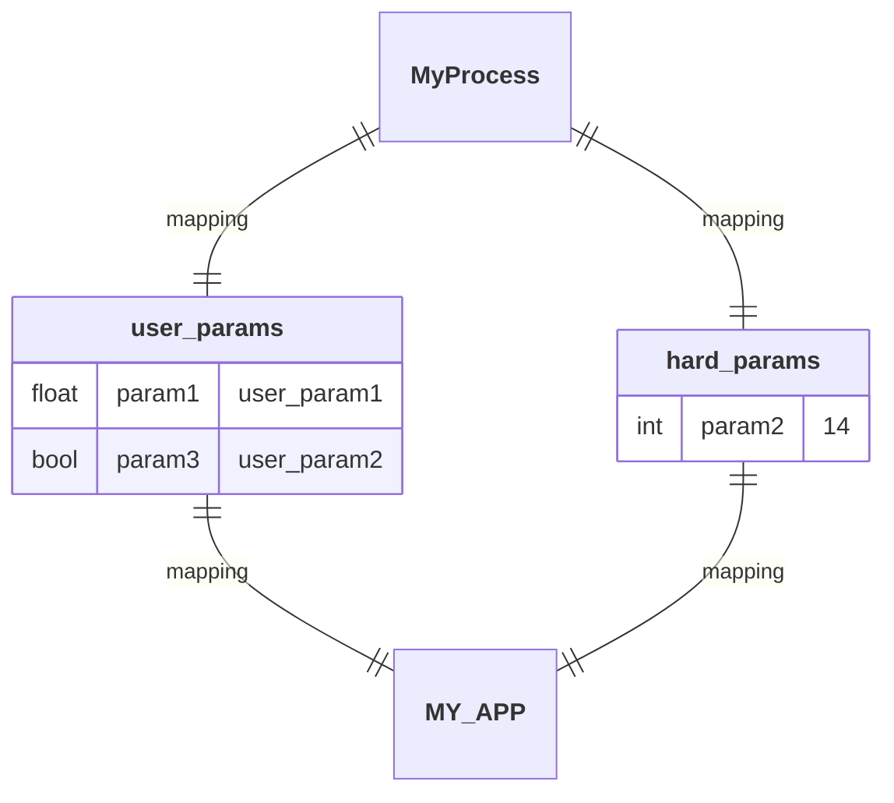
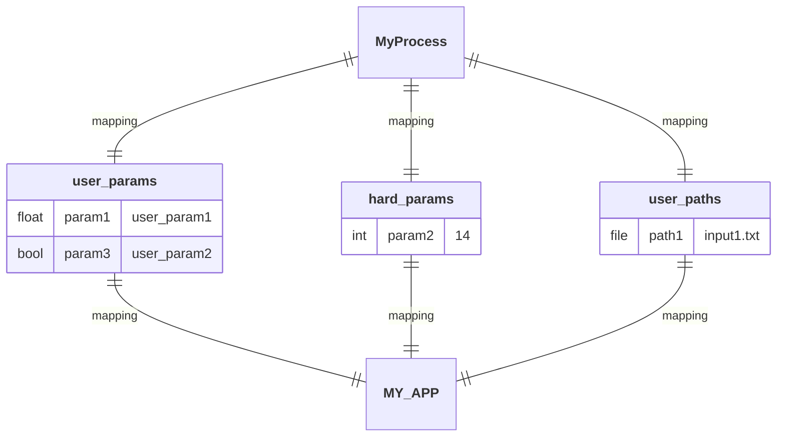
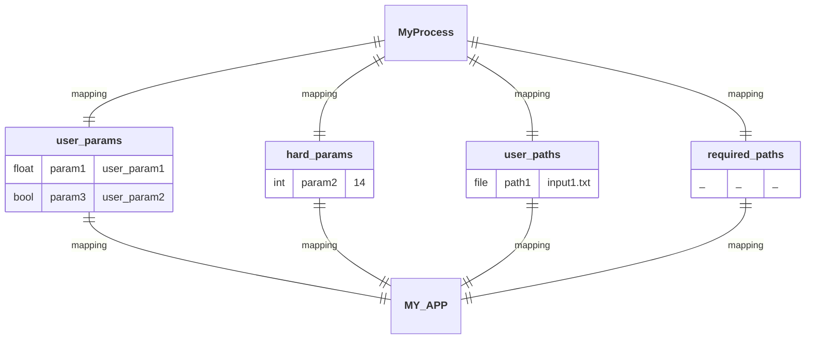
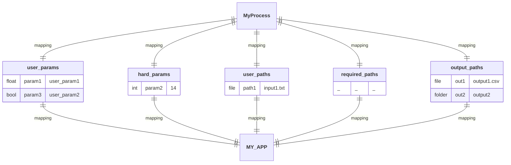
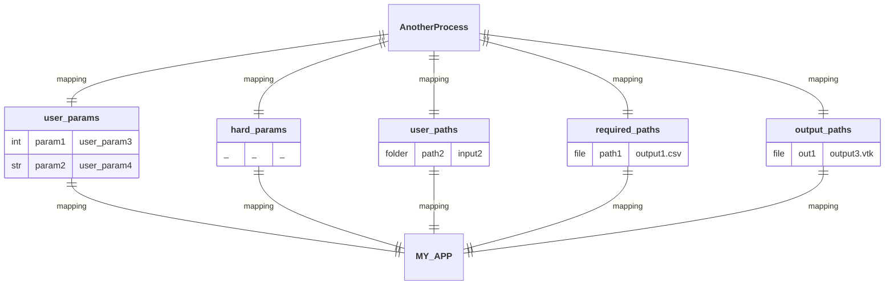
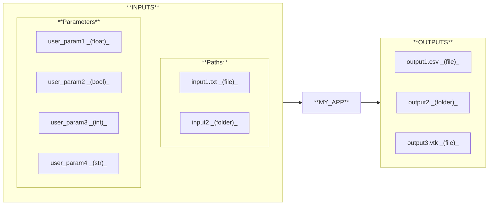

# NUREMICS®

**NUREMICS®** is an open-source Python™ framework for developing customizable scientific workflows.

  
  
  
  
  

## Foreword

The **NUREMICS®** project is organized into two complementary repositories:

- **`nuremics`**  _(current repository)_: This repository is the core Python library, installable via `pip install`. It provides the foundational components to create modular and extensible software workflows.

- **[`nuremics-apps`](https://github.com/nuremics/nuremics-apps)**: This repository contains examples of end-user applications built using the **NUREMICS®** framework. It is intended to be **forked** by developers to initiate their own `nuremics-apps` project and build custom applications tailored to their specific use cases.

Developers are encouraged to treat `nuremics` as the core engine, and to use `nuremics-apps` as a starting point for developing and maintaining their own scientific software built on top of the **NUREMICS®** framework.

## Project Philosophy

**NUREMICS®** is built with the ambition of bringing robust software engineering practices into Python-driven scientific research and development.

While Python has become the de facto standard for scientific computing, its use in R&D environments is often limited to ad-hoc scripts or notebooks. This leads to critical limitations: unclear definition of inputs, algorithms, and outputs; hard-coded parameters that hinder reproducibility; and inefficient workflows for exploring parameter spaces. As a result, scientific studies are often conducted in a “one-shot” manner, making them difficult to reproduce or extend. Output data is rarely traceable in a structured way, and codebases suffer from poor modularity, limited reusability, and frequent duplication. These challenges are compounded when teams grow, as scripts and notebooks are difficult to scale and maintain collaboratively, increasing the risk of undetected errors.

In regulated industries where scientific results directly support product development (e.g., MedTech, Biotech, Aerospace), such fragility can have severe consequences. This is also why many of these industries remain hesitant to adopt Python and its powerful open ecosystem, due to concerns about reliability and long-term maintainability.

In this landscape, **NUREMICS®** emerges as a unifying framework designed to address these challenges: it provides a rigorous development structure that empowers scientists, engineers, and researchers to deliver high-quality scientific outcomes, and take their research to the next level. By enabling the safe integration of tools from the Python ecosystem, **NUREMICS®** supports the engineering of domain-specific scientific software with the discipline, testability, and maintainability required in high-stakes industrial environments.

Inspired by **IEC 62304**, a standard originally developed for the engineering of medical device software, **NUREMICS®** promotes structured, layered software development through clearly defined architectural components: systems, items, and units. This organization fosters clarity, modularity, and maintainability, while remaining well-suited to the iterative, exploratory nature of scientific development in Python.

Although **NUREMICS®** does not aim for full compliance with **IEC 62304**, it selectively incorporates its most relevant principles, striking a pragmatic balance between engineering rigor and the agility required in fast-paced research environments.

## Architecture Overview

The software architecture of **NUREMICS®** is illustrated in the diagram below. As previously mentioned, it follows the layered structure recommended by the **IEC 62304** standard, distinguishing between _software systems_, _software items_, and _software units_. This representation provides a clear, high-level view of how the different software components of the project are organized, and how they interact within a structured yet flexible development framework. It also highlights the relationship between the core framework (`nuremics`) and its domain-specific applications (`nuremics-apps`), emphasizing the modular and extensible nature of the overall architecture.

In the context of **NUREMICS®**:

- A _software unit_ corresponds to a single, testable function. It is the smallest building block of logic.

- A _software item_ typically takes the form of a Python class that encapsulates related functions (units) to serve a specific purpose.

- A _software system_ refers to a complete application designed to be executed by an end user, replacing traditional scripts or notebooks.

In practice, the core framework `nuremics` is composed of three foundational _software items_:

- The `Process` class defines a generic **process item**. It provides a flexible base structure that can be extended to implement domain-specific processes within `nuremics-apps`.

- The `Workflow` class orchestrates the execution of multiple processes in a defined sequential order. It encapsulates the coordination logic and manages the progression of tasks throughout the workflow.

- The `Application` class is the top-level component. It instantiates and executes a workflow, acting as the main entry point for any end user application developed within `nuremics-apps`.

In `nuremics-apps`, two main types of software components are developed to build domain-specific applications:

- **Process items** (_software items_) — such as `Proc1, Proc2, ..., ProcX` — are implemented by subclassing the core `Process` class. Each process is defined as a class that encapsulates several functions (_software units_), typically executed sequentially within its `__call__` method. This design enables the creation of independent, reusable **process items** that can be executed on their own or integrated into larger workflows.

- **Applications** (_software systems_) — such as `APP1, APP2, ..., APPX` — are the end-user-facing software applications. They import and assemble the required **process items**, executing them in a defined order through the `Workflow` class, by instantiating the `Application` class. This modular architecture promotes flexibility and reusability, allowing the same **process items** to be used across multiple applications tailored to different scientific purposes.

## Design Patterns

Let’s briefly introduce the core design patterns behind **process items** and **applications** in **NUREMICS®**.

### Process item

A **process item** can be seen as an algorithmic box which processes some input data and produces corresponding output data.

The input data typically fall into two main categories:

- **Input parameters**: Scalar values such as `float`, `int`, `bool`, or `str`.

- **Input paths**: Files or folders provided as `Path` objects (from Python's `pathlib` module), pointing to structured data on disk.

As previously mentioned, the algorithmic box of the **process item** is a class composed of functions (units) called sequentially with its `__call__` method.

Output data are typically expressed as `Path` objects as well, corresponding to files or folders written to disk during the execution of the process.

For the sake of example, let's define another **process item** considering the same structure.

### Application

A final end-user **application** can be built by plugging together previously implemented **process items**, and specifying their sequential order of execution within the workflow.

Each **process item** integrated into the **application** defines its own set of inputs and outputs, specific to its internal algorithmic logic. When these **process items** are assembled into a workflow, the **application** itself exposes a higher-level set of inputs and outputs. These define the I/O interface presented to the end user, who provides the necessary input data and retrieves the final results upon execution.

The assembly step is performed through a mapping between the internal I/O data of each **process item** and the global I/O interface of the **application**. This mapping mechanism serves multiple purposes:

- It defines which data are exposed to the end user (and how they are displayed) and which remain internal to the workflow.

- It manages the data dependencies between **process items**, when the output of one process is used as input for another.

This notably ensures a coherent and seamless management of data across the workflow, while delivering a clean and focused I/O interface tailored to the user's needs.

The mapping between a **process item** and the **application** starts by specifying which process input parameters are exposed to the end user, and how they are labeled in the **application** input interface.

The process input parameters that remain internal to the workflow are assigned fixed values directly within the mapping definition, without being exposed to the end user.

The process input paths that need to be provided by the end user are specified by defining the expected file or folder names within the **application** input interface.

The process input paths can also be mapped to output paths produced by a previous **process item** within the workflow (although this does not apply here, as we are currently focusing on the first process in the workflow).

Finally, the process output paths are specified by indicating the name of the file(s) or folder(s) that will be written during the workflow execution.

Let's now assemble the second **process item** to be executed by the **application** within the workflow, by establishing a dependency: the output data produced by the first **process item** will serve as input data for this second one.

## Get Started

To begin your coding journey with the **NUREMICS®** framework, you can now head over to the [`nuremics-apps`](https://github.com/nuremics/nuremics-apps) repository. There, you'll learn how to build domain-specific processes and applications, and how to use them as an end user.